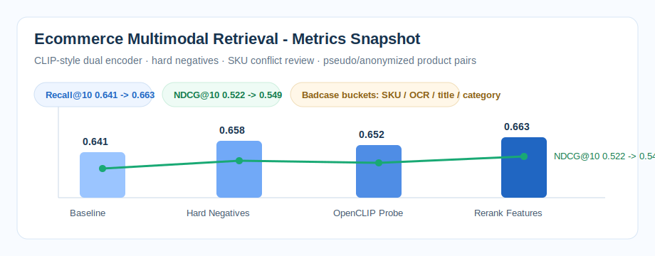

# ecommerce-multimodal-retrieval

E-commerce image-text retrieval reproduction for product title-image matching, CLIP-style dual-encoder retrieval, hard negative construction, top-k evaluation, threshold analysis, and badcase review.

The repository focuses on a common e-commerce retrieval problem: titles and main images may look similar while SKU attributes, variants, bundle counts, or OCR marketing text make the match wrong. The workflow is intentionally offline and inspectable: schema, retrieval scripts, metrics, threshold records, and badcase buckets are kept in the repo.

**Public data boundary:** this repo is a sanitized reproduction of the workflow, not the original internship code or data. It uses the same field design, retrieval chain, metric style, and badcase taxonomy with pseudo/anonymized samples; no private merchant, product, or platform data is included.

## Project Positioning

- Scenario: e-commerce product image-text matching / similar product retrieval.
- Core problem: high-score false positives caused by similar titles or similar main images but conflicting SKU attributes.
- Baseline: Chinese-CLIP / OpenCLIP style dual encoder.
- Retrieval: vector search with top-k evaluation.
- Metrics: Recall@10, NDCG@10, false-positive review, bucketed badcase analysis.

## Evidence Snapshot



## Evidence Pack

For interview review, see [`evidence_pack/`](evidence_pack/). It contains project overview, data schema, metric definitions, experiment CSV, ablation CSV, badcases, run commands, boundary statement, and whiteboard notes.

| Experiment Topic | Repository Artifact |
|---|---|
| Product title-image matching / similar retrieval | `data_schema.md`, `scripts/build_pseudo_pairs.py`, `outputs/product_pairs.csv` |
| CLIP-style dual encoder baseline | `scripts/train_clip_baseline.py`, `outputs/model_meta.json`, `outputs/embeddings_preview.json` |
| Hard negative construction | `experiments.csv`, `ablation.csv`, `badcases.csv`, `docs/interview_qa.md` |
| SKU conflict and OCR noise review | `badcases.csv` with 10 anonymized failure buckets, `assets/results_summary.md` |
| Recall@10 / NDCG@10 evaluation | `experiments.csv`, `outputs/metrics.csv`, `scripts/evaluate_retrieval.py` |
| Interview-safe boundary | `docs/experiment_log.md`, `docs/interview_qa.md` |
| Public reproduction boundary | `docs/dev_log.md`, `tests/` |

## Data Boundary

If asked whether the resume-side 8000 title-image pairs and this GitHub repo are the same dataset, the answer is:

> No. The resume describes the internship-side offline sample/review protocol, which cannot be published. This GitHub repository is a sanitized public reproduction of the same workflow: same schema style, same hard-negative logic, same Faiss-style retrieval evaluation, same metrics table format, and same SKU/OCR/title/category badcase taxonomy, but no internal merchant/product/platform data.

## Repository Structure

```text
.
├── README.md
├── data_schema.md
├── experiments.csv
├── ablation.csv
├── badcases.csv
├── Makefile
├── run.sh
├── requirements.txt
├── scripts/
│   ├── build_pseudo_pairs.py
│   ├── train_clip_baseline.py
│   └── evaluate_retrieval.py
├── tests/
│   ├── test_badcases.py
│   ├── test_metrics.py
│   └── test_pseudo_pairs.py
└── assets/
    └── results_summary.md
```

## Quick Start

Recommended:

```bash
make all
```

Equivalent manual commands:

```bash
python scripts/build_pseudo_pairs.py
python scripts/train_clip_baseline.py
python scripts/evaluate_retrieval.py
python -m pytest -q
```

The scripts create pseudo product pairs, train a lightweight CLIP-style dual encoder, and compute retrieval metrics from exported embeddings.
The generated sample is small by design so reviewers can run the full pipeline quickly; the important part is the retrieval/evaluation structure, not the absolute metric value.

## Interview Talking Points

1. Hard negatives are domain-specific: same category different style, same image different SKU, similar title but different product.
2. SKU conflicts matter: color, size, model number, bundle count, and variant attributes can create dangerous false positives.
3. Do not claim online ownership: this is an offline sample / manual review set used for threshold and badcase analysis.
4. Always discuss bucketed evaluation: category, OCR ratio, subject area, title length, and score range.

## What This Repo Does Not Claim

- It is not a full online product-search owner project.
- It does not contain merchant private data or real SKU catalogs.
- It does not claim online A/B lift.
- It is an offline reproducible workflow for multimodal retrieval, threshold review, and badcase discussion.
